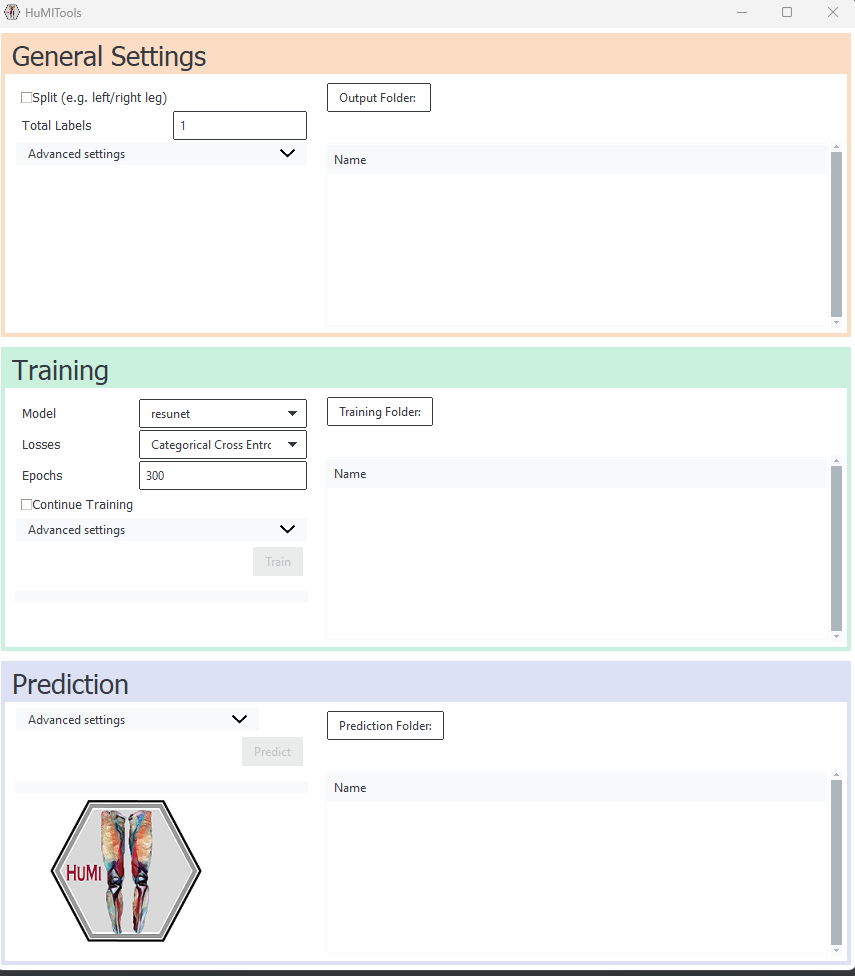
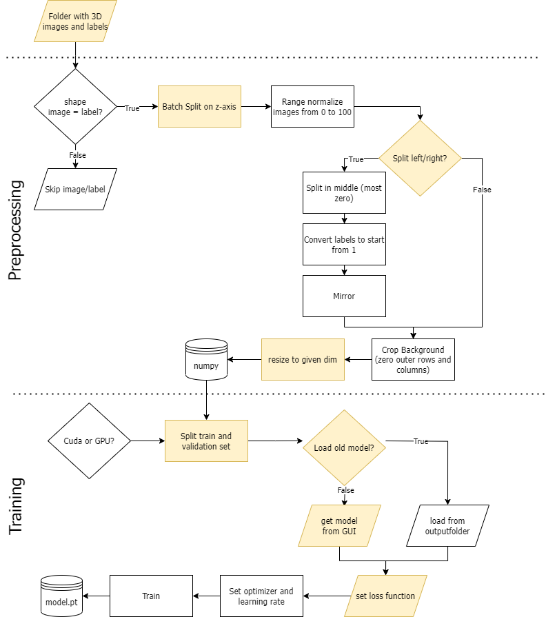
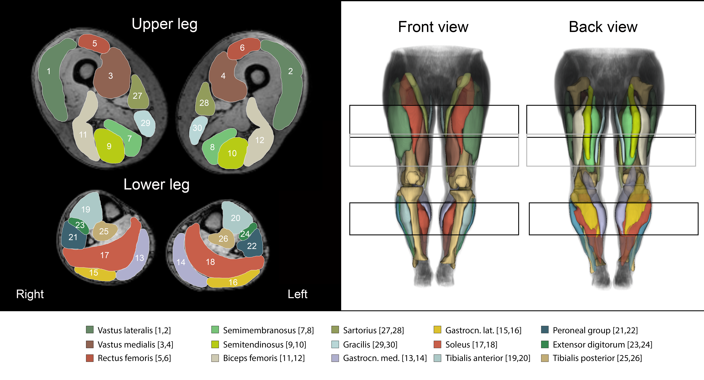
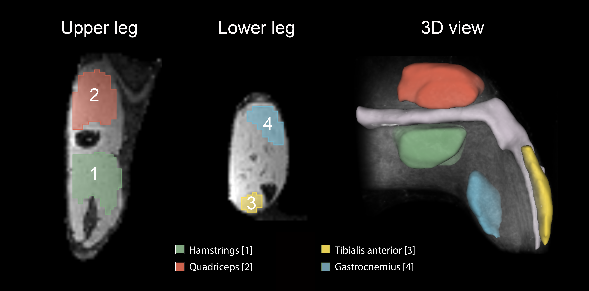

# IMPORTANT: This README is preliminary and still under development!
# HuMITools: Segment biological bodies

Whether you work with muscles or brains of mice or men, manual segmentation of MR-images is needed often. This time consuming process can be accelerate by using artificial intelligence.

HuMITools is an OpenSource project that provides pretrained models or enable users to quickly train a model to their own personal needs and predict biological bodies.

## Installation

There are currently two options for installation. 
- Install Executable: Downloadable via the releases (https://github.com/HuMI-Group/HuMITools/releases).
- Advanced Installation: Follow the advanced installation guide (see below) to run the code in a python environment.

### Advanced Installation

This project is implemented in python. If you want to adapt the code, develop your own networks or alter our preprocessing pipeline, you will need to set up a python environment. For the purposes of this guide, we will assume that you have conda installed on your pc and use an IDE that you are familiar with.

1. Clone the github repository to a folder
2. Open the main directory in a terminal, this should contain a file called environment.txt
3. In the terminal, then type: “pip install -r requirements.txt”
4. Within your chosen IDE open the project and set the newly created virtual environment “HuMITools” as the python interpreter. 
5. To test whether everything worked, navigate to the main_GUI.py file and run it. A GUI as depicted in the images below should open.

# User guide
HuMITools is a python tool to train segmentation networks and predict segmentations

## First use
Opening the GUI, it will ask for an output folder. The output folder is the place where models will be saved during training and labels 
after prediction. It is also a folder were all temporary details are stored during processing and where the current seession is saved as a .json.
The .json is a file created during training and again saved after closing the GUI. It will save your latest settings so that you can easily 
continue your training or prediction another time.

## Data requirements
1.	HuMITools accepts only (3D) nifty files (.nii or .nii.gz)
2.	Labels belonging to images should have the same name with an additional "-label" (i.e. dataset1.nii.gz and dataset1-label.nii.gz) and be stored in the same folder.
3.	The background of all label.nii.gz should be labeled zero
4.	The ROI labels should be integers and consistent over all datasets.

## System requirements

HuMITools is designed to allow users with a wide range of systems to predict Labels from their Niftis. 
Predicting from pretrained models is fast and light weight, training of models is very time consuming.
Predicting labels on a reasonably modern laptop takes less than one minute per image.
For users that follow the labeling scheme of our group, we provide pretrained models that can be used without further training,
For the prediction of images the following is required:
1. 16 Gb of RAM
2. A modern 64bit Operating system (We have tried predicting images on M1 Macs, Debian Derivatives and Windows 10/11 machines)
3. 2 GB of free disk space

Training of Neural Networks is a lot more demanding on the system and should ideally be performed using a CUDA enabled Nvidia GPU. 
For training on a GPU we recommend a NVIDIA GPU with 24 GB of VRAM (Nvidia Quadro RTX 6000, Nvidia RTX 3090) and 16 GB of RAM.
If you have no access to a high end GPU and your data necessitates a newly trained model, a modern PC with 24 GB of RAM can be used.
In our work we have observed that training on a modern GPU speeds up training times by *6 in comparison to training on a CPU.
On our Machine (Quadro RTX 6000, 256 Gb of Ram, 24 CPU Cores) using a large training datasets (300 datasets), training for 400 epochs takes around 2 days.
Training utilizing RoCM (AMD) or Apple Silicon is currently not enabled.

## General settings
There are two general settings that you have adjust no matter if you train or predict.
First, do you want to split your data on the z-axis? This might be the case for symmetrical data like legs.
Second, what is the total number of your labels (e.g. number of muscles)? Keep in mind, that when say yes to split, the sum of labels is only important for one side. 
In case you already have a pretrained model in your output folder, that number will be set automatically.

## Training
To train a network on your individual dataset, you need images that are already segmented. During training, images will be normalized, the background will be cut and all images will be zoomed into the same dimension. The workflow and an axplanation of settings is listed below:

1. Click on "What should be trained?" to choose a folder with images and their respective labels.
2. On the left side you can choose the model and a loss. For recommendations for models read further down. The preprocessing will be done automatically. 
3. Choose the number of epochs the network should train on. To just look if everything is working, we recommend to train for 5 epochs (lower epochs might result in the model not being saved). Later on, the best results will be achieved with 300-500 epochs.
4. You can train an existing model by checking the box "Continue Training".
5. Click train.

Depending on your hardware, the epochs and the datasets the training might take a while. 
Before training, the data will be preprocessed. For that, all images and labels will be converted to 3D numpy, which will be stored in separate folders called "image_numpy" for the images and "label_numpy" for the labels. These folders can be found in the defined output folder, in a separate folder called "TEMP". 
Additionally, four .nii files will be stored that can be used to check if after proprocessing the labels are still in their correct places. 
The model (.pt) will be saved in the outputfolder after a few epochs and updated every few epochs.

### Advanced settings
Depending on your hardware the training might take very long. This can be improved by reducing the batch size or the resolution of the images.
On the other hand, if the training is fast you can improve the outcome by increasing the batch size or image resolution.

## Predicting
To predict images, you need a trained model. Either you train it yourself or, in case your data is similar to ours (out phase reconstruction from Dixon data), you can use pretrained models. 
1. The model (.pt) has to be in the output folder and the general settings have to be filld correctly
2. Clicking on "What do you want to predict?" to choose the folder with images that you want to create labels for. 
3. With those settings set, you can predict your images by clicking the button "Predict". This should be relatively fast, but depending on the amount of images and your hadware. The resulting labels will be saved in the output folder.

## Pretrained models
The pretrained models are trained on either upper or lower legs of human MRI scans.
We used a large, heterogenouse datasets as published in the paper below.

When using our models you have to check the split checkbox to split the left and right leg on the z-axis. 
The number of labels for upper leg being 8 and lower leg being 7.

# Recommended workflow for small datasets
If you have limited amounts of manually segmented nifti files, we recommend the following workflow:

1. Train a network on all images with labels from your database for at least 200 epochs
2. Use the so trained model to predict the images you have not segmented yet
3. Use a tool like 3D Slicer (https://www.slicer.org/) to manually refine the predicted labels
4. Train the network again on previously finished labels and the so manually refinded labels 
5. Repeat to predict, manually refine and retrain the model until your model predicts the labels perfectly well so that you do not have to manually refine anymore

This workflow was sucessfully applied to an MRI dataset of mouse leg muscles

## Network recommendations
All networks presented here are adaptations of published papers, often altered so as to fit into limited vRAM or CPU memory. The program will check for cuda availability and will run on the GPU if a Nvidia GPU with cuda support is found.
If possible, we recommend “Resunet” . If you have sufficient memory, increase batch size, so that it is divisible by 8. If you have no access to a computer that can train Resunet, use “unet”. 
“Hoffentlich_Alex” is a homebrew project and should not be used for projects that aim for publication. Our group has found that “Hoffentlich_Alex” beats “ResUnet” for the segmentation of calves and thighs in human and mice, but this model did not go through peer review in any shape or form. 
There will be no support for problems that arise from using “Hoffentlich_Alex”!

# Limitations
Unfortunately we cannot provide you with trainings datasets, due to data privacy. But we provide you with MR images of our own leg muscles, so that you can see on what the pretrained models are trained on.
When changing any of code, apply advanced settings or use a not implemented model, this is on your own risk.

# Questions
If you have any questions, need help on predicting your data or want to contribute your data to make the pretrained networks even more powerful feel free to contact us!

# Sources

Most models and Loss functions implemented here were taken (and adapted) from literature sources, see the paper.pdf file a list.