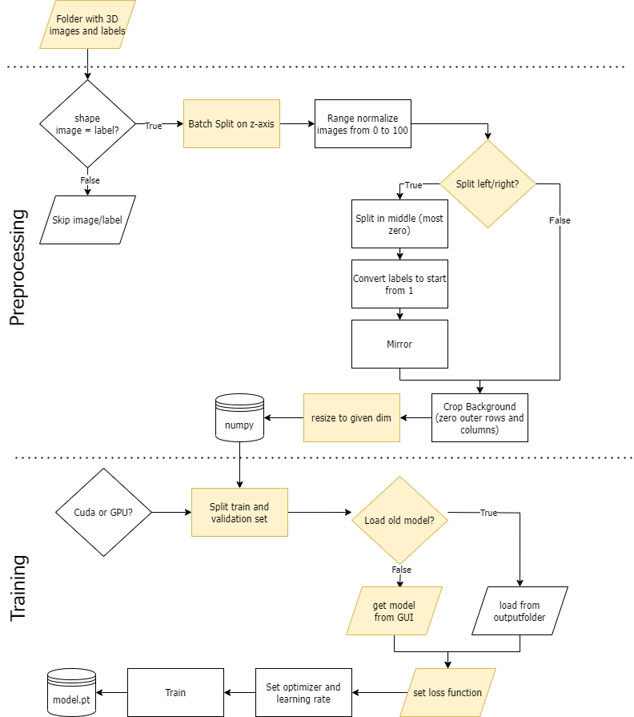

#General introduction

HuMITools is a program written in Python that enables users to easily train Convolutional Neural Networks (CNN)
to perform segmentation of 3D Nifti images and use pretrained models to easily generate segmentation maps
for biological bodies. The toolbox is developed using Pytorch for training on MR images with their respective
labels and prediction of MR images. It  is based on work previously published work on the segmentation of lower leg muscles
(10.3390/diagnostics11101747). Currently, the process of manually segmenting images is a time-consuming bottleneck 
in the evaluation of quantitative MRI images. To solve this issue users can either train a CNN on their own using their 
own labeled data, or use pretrained models that are provide for lower and upper leg muscles. These pretrained models are
trained on a large heterogenous database including both healthy participant and patient data, with images mainly being T1
weightes, but also Fat or Water as well as NIFTI files from multiple contrasts (hier besseres Wort, e.g. T1 weighted, 
Fat weighted, Water weighted).

#Aims and scopes

The software was developed to reduce time cost for researchers that work with
3D Nifti files requiring segmentation as part of their processing pipeline.
HuMITools is separated into two functional units, 
training and predicting that can be used independently from one another. 
A pretrained models can be used to predict labels for MR images.
Another option is to use the software in a kind of feedback loop, 
where even a small amount of image and label pairs can be trained, 
new data be predicted and manually refactored and reused to train anew with a larger dataset.
For easy use, a GUI was implemented that handles preprocessing, training and prediction. 

#Data requirements

HuMITools is designed to automatize the segmentation of 3D Nifti files, 
both packed as nifti.gz files or as unpacked .nifti files. If users want 
to train their own models, each file requires a corresponding “*-label.nifti” file
in the same image resolution that contains the correct labels, contained in the same folder.
In the label file, the background should be labeled as “0”.

#Preprocessing Options

Irrespective of the specific use case, all data will be automatically preprocessed for further use.
The preprocessing pipeline follows a specific order and is depicted in \autoref{fig:example}.. First all images are split on the third image dimension
(which is the z axis in our data) if the axis is longer than 25 slices. The resulting split images are
range normalized from 0 to 100. For anatomical symmetric bodies like arms or legs, the data should be split and mirrored,
for which the “split”-checkbox needs to be activated. After this, the label numbers will be sorted into categories,
starting with the background. To reduce empty space, background of the images is cut and then all images scaled
up to the image resolution set in the GUI.

